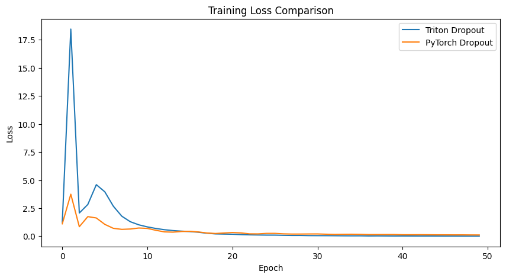

# triformer

triformer is a library that implements the transformer models in triton.
that's it nothing special .


### Installation 
- First install triformer 
```bash
pip install triformer
```
```python
from triformer import  TritonLayerNorm, TritonSoftmax
```
# Benchmarking 
The benchmarking was done on the L40s GPU 

### Layer Normalization

Updated the layernorm kernel to a more redable code.

| Forward | Backward | Combined |
|---------|----------|----------|
|  |  |  |


### Softmax
The softmax kernel is also implemented in Triton and it is blazing fast. it was actually more easier than the layer normalization to implement in triton.


| Forward | Backward | Combined |
|---------|----------|----------|
|  |  |  |

### Dropout
The droput kernel was intresting it was a bit tricky to implement especially the backward pass, but I asked claude for some help and it was able to help me out.

Tried Training a simple MLP with the TritonDropout, looks like its doing good.




## Test for each components 
-  Layernorm test has been addded, when testing the layernorm the weights and biases were not quite similar to torch but there was a bit of difference in the values.So i had to use  `rtol=1e-0`, `atol=1e-0` to pass the test.
-  As for the softmax I actually tests on `causal=False`
  

To run the tests 

- First git clone the repo 
```bash 
git clone https://github.com/dame-cell/Triformer.git
```
- Then navigate to the Triformer/tests directory 
```bash
cd Triformer/tests
```
- Install triformer
```bash
pip install -U triformer
```
- Then run the tests 
```bash
pytest tests/test_layernorm.py
pytest tests/test_softmax.py
pytest tests/test_dropout.py
```

## Future Plans - To Do
- [ ] Create a library specifically for transformers in vision and language
- [x] Implement the layernorm in Triton 
- [x] Implement the softmax in Triton 
- [x] Implement the dropout in Triton
- [x] add test for each and every component
- [ ] Add better checkmark for precision like either float16 for mixed-precision or use float32 

