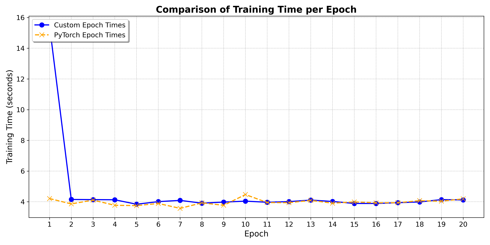

# triton-transformers

This will be an implementation of  transformers using triton, 
- This is my first introduction to low-level GPU coding neurel networks i guess. 
- I will try to Also train the model not sure yet but maybe 
- As of right now I am still learning Triton 

## The plan  
my plan is to start with simple neurel network and then move upwards to transformers 

- I have been able to code and train a very simple MLP using triton on the Cifar10 datasets but it is kinda slow 6 seconds per epoch whereas pytorch is 3 seconds per epoch now my task is too try to optimize this code and then I will push the code here 

# Comparison between pytorch and triton 

- It seems that the training time is more or less the same pretty cool 
  
## Resources I used to learn 
- first learn the architecture for modern gpu using any resources you find is good for you
- Learn a bit of cuda programming - https://www.youtube.com/watch?v=nOxKexn3iBo&t=3078s ( this video help a lot)
- For  beginners this video on triton really help  a lot - https://www.youtube.com/watch?v=GHQ1M3VDOmU&list=PLSXcJOyFhmS-qb_CF-GLhkWxSmi-ftbPO
- This github repo provides puzzles for simple operations to simple flash attention to matrix multiplication - https://github.com/srush/Triton-Puzzles
