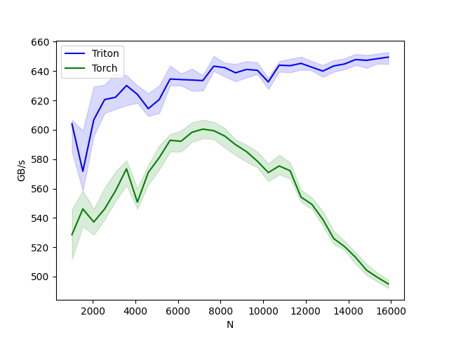
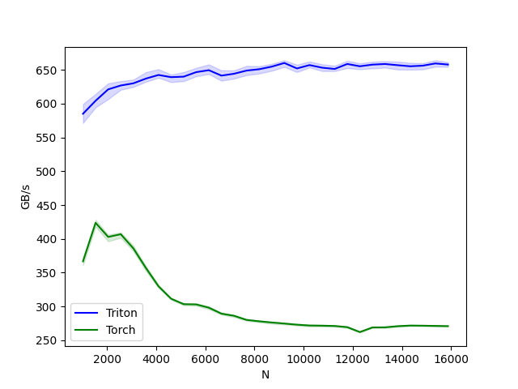
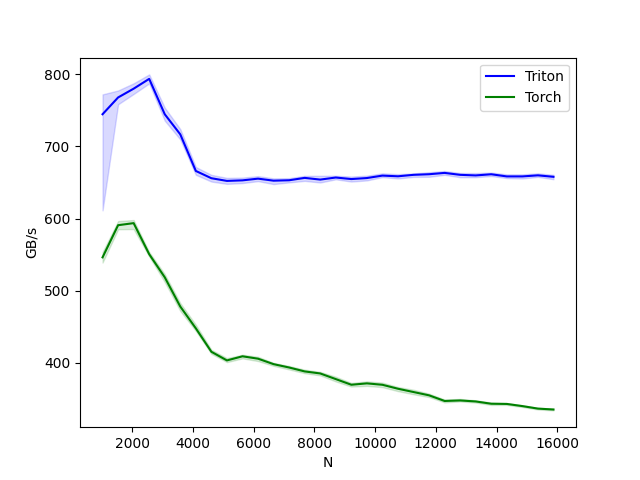
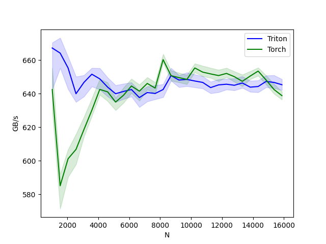
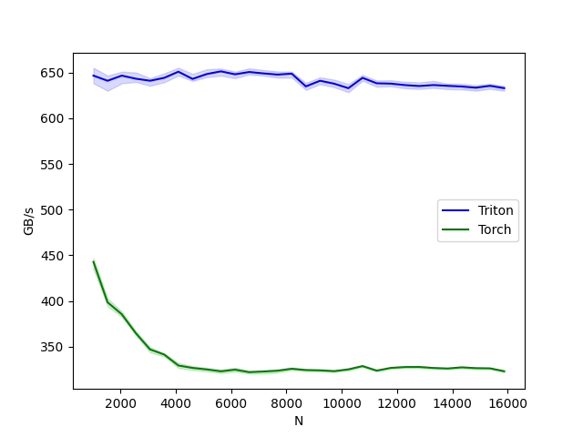
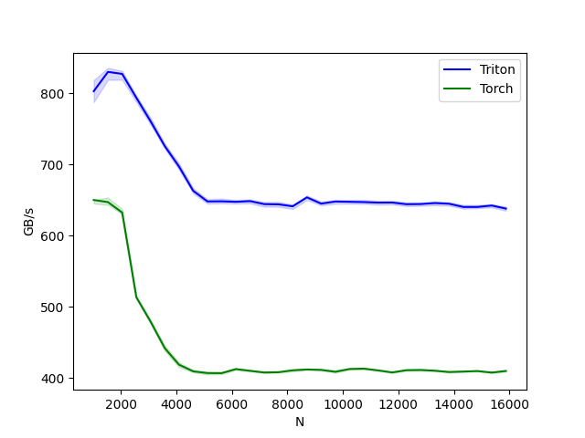
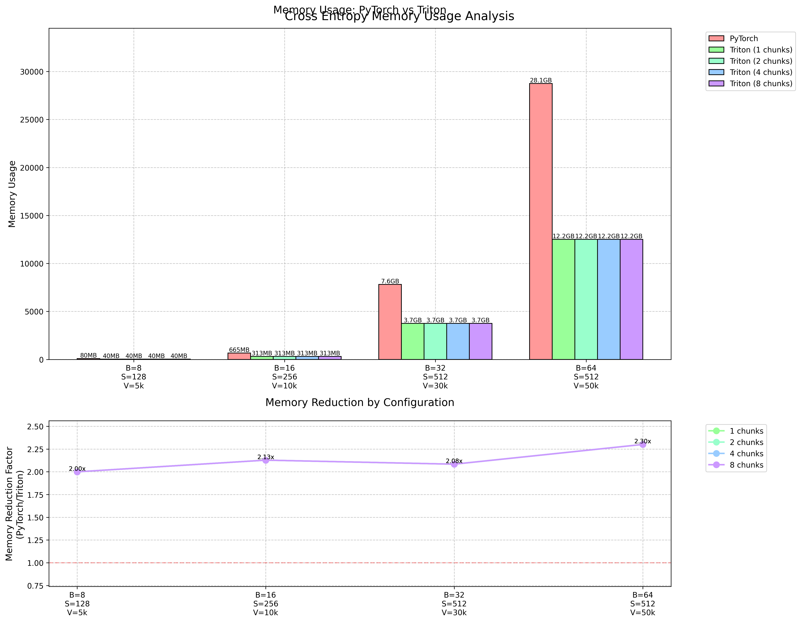

# Triformer

<div align="center">

<picture>
  <source media="(prefers-color-scheme: light)" srcset="triformer/images/triformer-light.png">
  
</picture>

**High-performance Transformer components accelerated with Triton CUDA kernels**


[](https://badge.fury.io/py/triformer)
[](https://opensource.org/licenses/MIT)

</div>

## Overview

Triformer is a high-performance deep learning library that implements transformer components using Triton kernels for efficient CUDA acceleration.

> **Note**: It is not the best but it works :D 

## Features

- 🚀 Highly optimized CUDA kernels via Triton
- 📊 Significant performance improvements over PyTorch implementations
- 🧮 Memory-efficient operations
- 🔧 Drop-in replacements for common PyTorch modules

## Installation

```bash
pip install -U triformer
```

## Components

### Layer Normalization
```python
import torch
from triformer import TritonLayerNorm

batch_size, seq_len, hidden_dim = 32, 64, 512
x = torch.randn(batch_size, seq_len, hidden_dim).cuda()

layer_norm = TritonLayerNorm(hidden_dim).cuda()
output = layer_norm(x)
```

### Softmax
```python
from triformer import TritonSoftmax

# Standard Softmax
softmax = TritonSoftmax(is_causal=False).cuda()
output = softmax(attention_scores)

# Causal Softmax (for decoder attention)
causal_softmax = TritonSoftmax(is_causal=True).cuda()
causal_output = causal_softmax(attention_scores)
```

### Dropout
```python
from triformer import TritonDropout

x = torch.ones(batch_size, seq_len, hidden_dim).cuda()
output = TritonDropout.apply(x, dropout_prob=0.5, seed=42)
```

### Cross Entropy Loss
```python
from triformer import TritonCrossEntropyLoss

criterion = TritonCrossEntropyLoss(
    pad_token_id=0,
    reduction='mean',
    n_chunks=1
).cuda()


loss = criterion(logits, targets)
```
## Examples 
You can now try out the GPT2 archtecture in the examples directory. 


## Performance Benchmarks

All benchmarks were conducted on NVIDIA L40s GPUs.

### Layer Normalization Performance

| Forward | Backward | Combined |
|---------|----------|----------|
|  |  |  |

### Softmax Performance

| Forward | Backward | Combined |
|---------|----------|----------|
|  |  |  |

### Memory Efficiency (Cross Entropy Loss)

Our cross entropy implementation achieves significant memory reduction through:

1. **In-Place Gradient Computation**
   - Reuses logits tensor for gradient storage
   - ~2x memory reduction vs PyTorch implementation
   - Optimal for large vocabulary sizes (30k-50k tokens)

2. **Micro-batch Processing**
   - Configurable chunk size for memory-compute trade-off
   - Enables larger batch sizes with limited GPU memory



## Testing

```bash
# Clone the repository
git clone https://github.com/dame-cell/Triformer.git
cd Triformer/tests

# Install dependencies
pip install -U triformer

# Run tests
pytest test_layernorm.py
pytest test_softmax.py
pytest test_dropout.py
pytest test_cross_entropy.py
```

## Roadmap

- [ ] Vision and Language Transformer Library
- [x] Core Operations:
  - [x] LayerNorm
  - [x] Softmax
  - [x] Dropout
  - [x] Cross Entropy Loss
  - [ ] Complete Transformer Implementation
- [ ] Llama2 Transformer architecture
    - [ ] RMSNorm
    - [ ] rotary positional embedding
    - [ ] swiglu
    - [ ] maybe we have to implement our own Grouped Query Attention (GQA) not sure yet 

## License

This project is licensed under the MIT License - see the [LICENSE](LICENSE) file for details.
