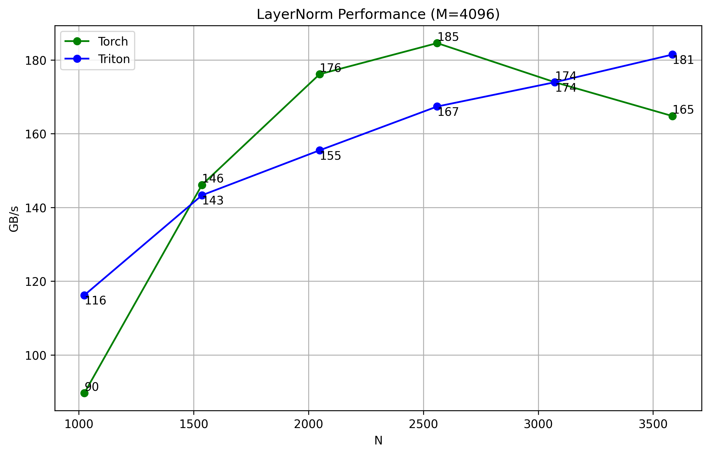

# triton-transformers

This will be an implementation of  transformers using triton, 
- This is my first introduction to low-level GPU coding neurel networks i guess. 
- I will try to Also train the model not sure yet but maybe 
- As of right now I am still learning Triton 

### Installation 
- First install triformer 
```bash
pip install triformer
```
- Then you can use the components 
- please keep in mind that the TritonLinear is a fused with relu
- As of right now the TritonLinear is very slow compared to the Pytorch Linear layer, I'm asssuming its because I divided the kernel into 3 parts and the overhead of switching between different kernels is causing the slowdown I'm still looking into it. I might fused the kernels to see if that helps. 


```python
from triformer import TritonLinear
class TritonMLP(nn.Module):
    def __init__(self, input_size, num_classes, hidden_size=768):
        super(TritonMLP, self).__init__()
        self.fc1 = TritonLinear(input_size, hidden_size)
        self.fc2 = TritonLinear(hidden_size, hidden_size*2)
        self.fc3 = TritonLinear(hidden_size*2, num_classes)

    def forward(self, x):
        x = self.fc1(x)
        x = self.fc2(x)
        x = self.fc3(x)
        return x
```

### Try it out!

You can try out the TritonMLP on CIFAR10 dataset using this Colab notebook:

[](https://colab.research.google.com/drive/1tupdi2hgIEY9zSZ9N47LmdUmbn3IE9pO?usp=sharing)


`I used a custom benchmark to test the performance because the one in triton is not intutive to me to use`



Scales well with increasing feature dimensions
- Particularly efficient for larger hidden sizes (N≥3072)
- Consistent performance scaling up to tested size of 3584
- No performance degradation at larger sizes


## Future Plans - To Do
- [ ] Create a library specifically for transformers in vision and language
- [ ] Make the TritonLinear more flexible to either use relu or not
- [ ] Fuse the kernels of TritonLinear to see if it speeds up the training process 

