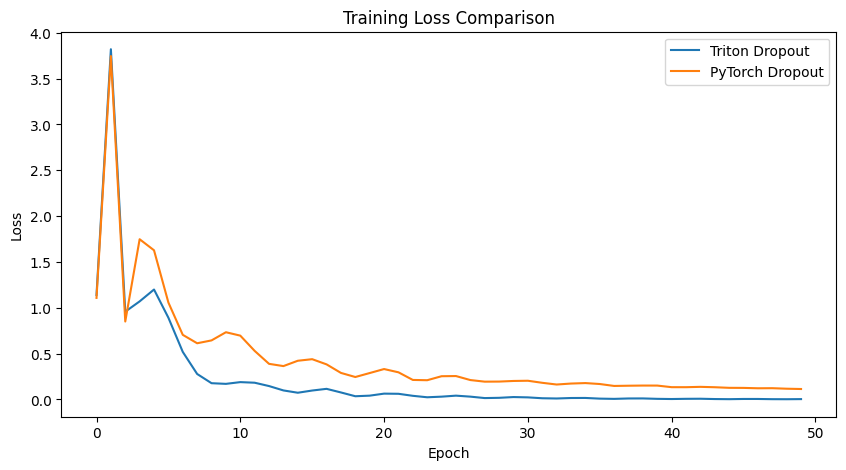

# triformer

triformer is a library that implements the transformer models in triton.
that's it nothing special .


### Installation 
- First install triformer 
```bash
pip install -U triformer
```
### Usage 
- Using TritonLayerNorm
```python
import torch
from triformer import TritonLayerNorm

# Create dummy data
batch_size, seq_len, hidden_dim = 32, 64, 512
x = torch.randn(batch_size, seq_len, hidden_dim).cuda()

# Initialize and use LayerNorm
layer_norm = TritonLayerNorm(hidden_dim).cuda()
ln_output = layer_norm(x)

# Print information about the tensors
print("Input shape:", x.shape)
print("Output shape:", ln_output.shape)


# Print a small sample
print("\nSample of output (first 5 values of first sequence):")
print(ln_output[0, 0, :10].cpu().detach().numpy())
```
```python 
# Softmax Example
from triformer import TritonSoftmax
import torch 
batch_size, seq_len = 32, 64
attention_scores = torch.randn(batch_size, seq_len, seq_len).cuda()

# Regular softmax
softmax = TritonSoftmax(is_causal=False).cuda()
regular_attention = softmax(attention_scores)

# Causal softmax
causal_softmax = TritonSoftmax(is_causal=True).cuda()
causal_attention = causal_softmax(attention_scores)

print("\n=== Softmax ===")
print("Input shape:", attention_scores.shape)
print("Output shape:", regular_attention.shape)
print("\nRegular softmax sample (first 5 values):")
print(regular_attention[0, 0, :5].cpu().detach().numpy())
print("\nCausal softmax sample (first 5 values):")
print(causal_attention[0, 0, :5].cpu().detach().numpy())
print("\nRow sums (should be 1.0):")
print("Regular:", regular_attention[0, 0].sum().item())
print("Causal:", causal_attention[0, 0].sum().item())
```

```python
from triformer import TritonDropout
import torch 
batch_size, seq_len, hidden_dim = 32, 64, 512
x = torch.ones(batch_size, seq_len, hidden_dim).cuda()  # Using ones for clearer demonstration

training_output = TritonDropout.apply(x,0.5,42).cuda()


print("\n=== Dropout ===")
print("Input shape:", x.shape)
print("Output shape:", training_output.shape)
print("\nSample output (first 10 values, showing dropout pattern):")
print(training_output[0, 0, :10].cpu().detach().numpy())
print("\nPercentage of non-zero values (should be ~0.5):")
print((training_output != 0).float().mean().item())
```
```python
from triformer import TritonCrossEntropyLoss

batch_size, seq_len, vocab_size = 32, 64, 30000
logits = torch.randn(batch_size * seq_len, vocab_size).cuda()
targets = torch.randint(0, vocab_size, (batch_size * seq_len,)).cuda()

criterion = TritonCrossEntropyLoss(
    pad_token_id=0,
    reduction='mean',
    n_chunks=1
).cuda()

loss = criterion(logits, targets)

print("\n=== Cross Entropy Loss ===")
print("Logits shape:", logits.shape)
print("Targets shape:", targets.shape)
print("Loss value:", loss.item())
print("\nSample logits (first 5 values for first item):")
print(logits[0, :5].cpu().detach().numpy())
print("Corresponding target:", targets[0].item())
```
# Benchmarking 
The benchmarking was done on the L40s GPU 

### Layer Normalization

Updated the layernorm kernel to a more redable code.

| Forward | Backward | Combined |
|---------|----------|----------|
|  |  |  |


### Softmax
The softmax kernel is also implemented in Triton and it is blazing fast. it was actually more easier than the layer normalization to implement in triton.


| Forward | Backward | Combined |
|---------|----------|----------|
|  |  |  |

### Dropout
The droput kernel was intresting it was a bit tricky to implement especially the backward pass,
Tried Training a simple MLP with the TritonDropout, looks like its doing good.




### Cross Entropy Loss

The cross entropy loss implementation in Triton achieves significant memory efficiency through two key optimizations:

1. **In-Place Gradient Computation**
- Reuses the logits tensor for storing gradients instead of allocating new memory
- Eliminates need for additional gradient storage
- Results in ~2x memory reduction compared to PyTorch's implementation
- Particularly effective for large vocabulary sizes (30k-50k tokens)

1. **Micro-batch Processing**
- Processes data in smaller chunks to reduce peak memory usage
- Configurable number of chunks via `n_chunks` parameter
- Trades a small amount of compute time for memory efficiency
- Enables processing of larger batches with limited GPU memory


 
 huge thanks to [mgmalek/efficient_cross_entropy](https://github.com/mgmalek/efficient_cross_entropy) for the reference.

## Test for each components 
-  Layernorm test has been addded, when testing the layernorm the weights and biases were not quite similar to torch but there was a bit of difference in the values.So i had to use  `rtol=1e-0`, `atol=1e-0` to pass the test.
-  As for the softmax I actually tests on `causal=False`
  

To run the tests 

- First git clone the repo 
```bash 
git clone https://github.com/dame-cell/Triformer.git
```
- Then navigate to the Triformer/tests directory 
```bash
cd Triformer/tests
```
- Install triformer
```bash
pip install -U triformer
```
- Then run the tests 
```bash
pytest tests/test_layernorm.py
pytest tests/test_softmax.py
pytest tests/test_dropout.py
pytest tests/test_cross_entropy.py
```

## Future Plans - To Do
- [ ] Create a library specifically for transformers in vision and language
- [x] Core Operations:
  - [x] LayerNorm in Triton 
  - [x] Softmax in Triton 
  - [x] Dropout in Triton
  - [x] Cross Entropy Loss in Triton
  - [ ] Feed Forward Network (fused GeLU + Linear in Triton)
  - [ ] The complete transformer model 