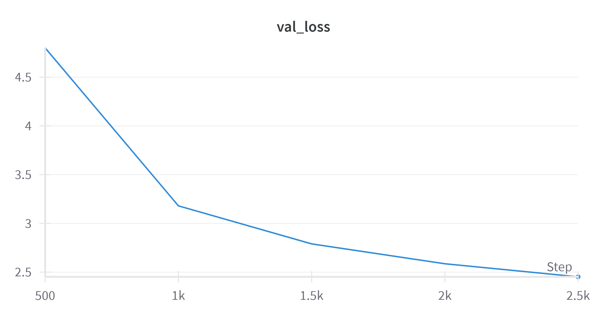
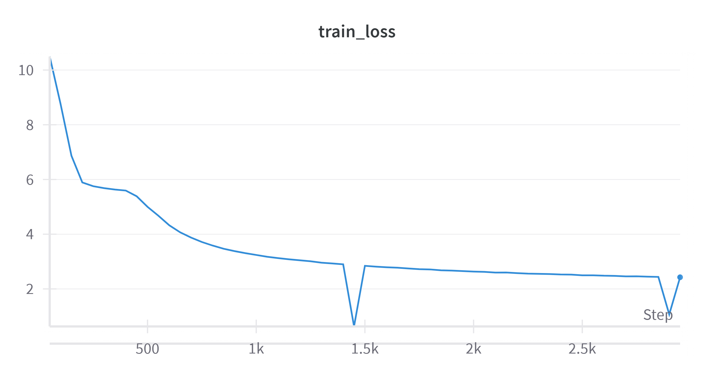

## gpt2.py

The `gpt2.py` file implements the GPT-2 model architecture.


Train a very small gpt2 model with only 17 million paramters on the tinystories dataset on a single A10 GPU 

and after 2500 step, this was how it generated :
```bash
Generated text at step 2500: Once upon a time, there was a little girl named Lily. She loved to play outside and explore the garden. One day, she found a big tree with lots of flowers. She wanted to see it out and see what was inside. She ran very fast and saw a bug that wanted to keep its friend. 

Lily's mom said, "Lily, you can't find your ball. Let's play together. Do you want to share it?". 
```

| train loss | val loss | 
|---------|----------|
|  |  |

